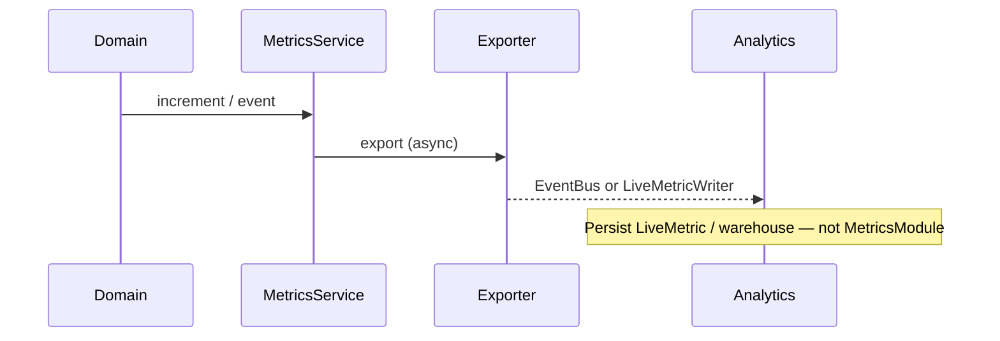

# Analytics Integration (Metrics)

Analytics module (future) should:

1. Subscribe to `metrics.emitted` / `telemetry.emitted`, **or**
2. Provide a `LiveMetricWriter` and register `LiveMetricExporterAdapter` into `METRICS_EXPORTER` composite.

Do **not** import Analytics into `shared/metrics`.
