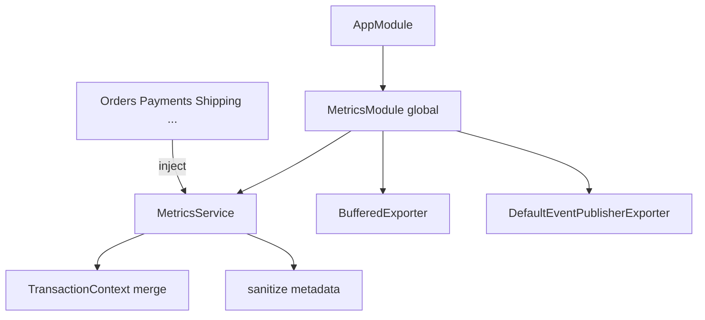

# Metrics & Telemetry Architecture

## Best practices

- Prefer counters/timings over huge metadata blobs  
- Use funnel fields for step tracking; leave conversion to Analytics  
- Call `flush()` on worker shutdown if buffering  
- Never put JWTs/passwords in tags or metadata  

See [MetricsFramework.md](./MetricsFramework.md), [ExporterArchitecture.md](./ExporterArchitecture.md).
