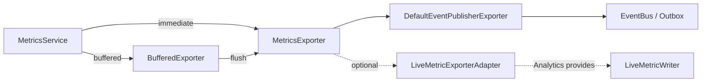

# Exporter Architecture

## Built-ins

- `NoOpExporter`
- `BufferedExporter`
- `DefaultEventPublisherExporter`
- `CompositeExporter`
- `LiveMetricExporterAdapter` (no Prisma)

Analytics binds `LIVE_METRIC_WRITER` / adapter later — not in this module.
