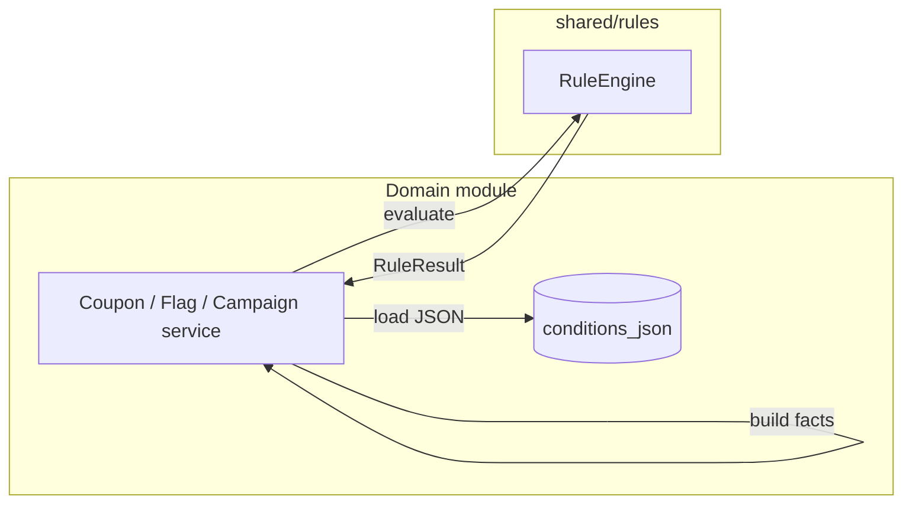

# Marketing Integration (Rule Engine)

Marketing / Coupons / Flags **own** persistence. They must **not** embed eligibility `if` trees; they call the shared engine.

## Pattern

1. Load `conditions_json` / `condition_json` from domain row.  
2. Build facts from request/context (cart, customer, now, …).  
3. `const result = this.rules.evaluate(conditions, facts)`.  
4. Branch on `result.matched`; log `result.reasons` / `result.errors`.

## Do not

- Put coupon/campaign types inside `shared/rules`
- Query Prisma from the rule engine
- Use `eval` for “flexible” conditions

This doc is guidance only — Marketing module is **not** implemented here.
