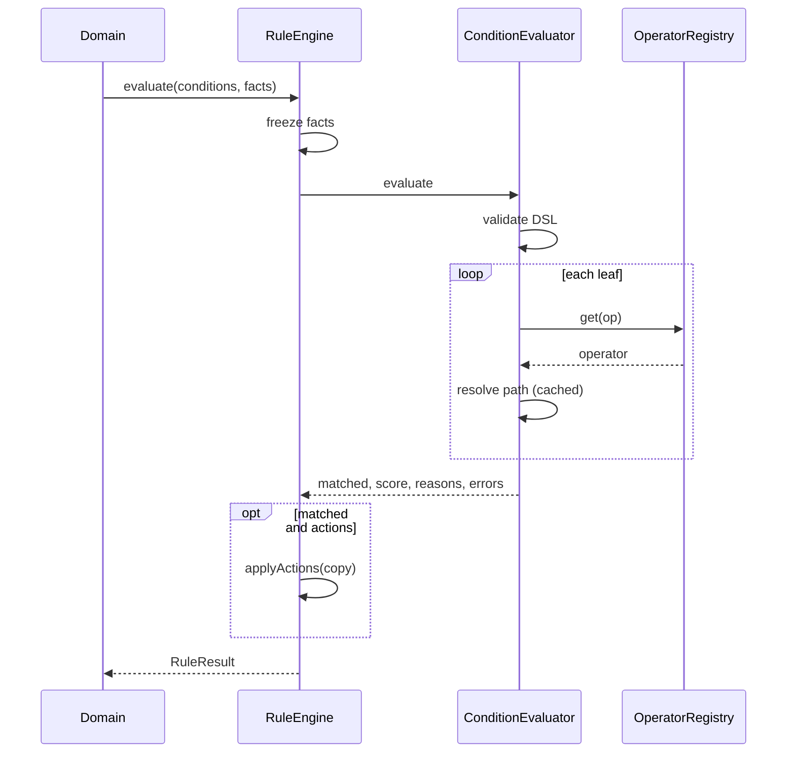

# Rule Engine

Shared pure evaluator: `backend/src/shared/rules/`.

## Purpose

Evaluate a **condition tree** against an immutable **facts** object and return a `RuleResult`. Domain modules own storage (`conditions_json`, etc.) and call:

```ts
ruleEngine.evaluate(conditions, facts, options?)
```

## Non-goals

No Prisma, Redis, BullMQ, controllers, repositories, APIs, or domain knowledge (coupons / flags / shipping / marketing).

## Components

| File | Role |
|---|---|
| `RuleEngine` | Public API + optional deterministic actions |
| `ConditionEvaluator` | `all` / `any` / `not` + short-circuit |
| `OperatorRegistry` | Pluggable leaf operators |
| DSL validator | Malformed tree → `errors[]` (no throw) |

## Sequence



## Security

No `eval`, `Function`, `vm`, dynamic imports, or third-party rule engines. Regex patterns capped at 256 chars.

## Wiring

`RulesModule` is `@Global()` and imported from `AppModule`. Inject `RuleEngine`.
