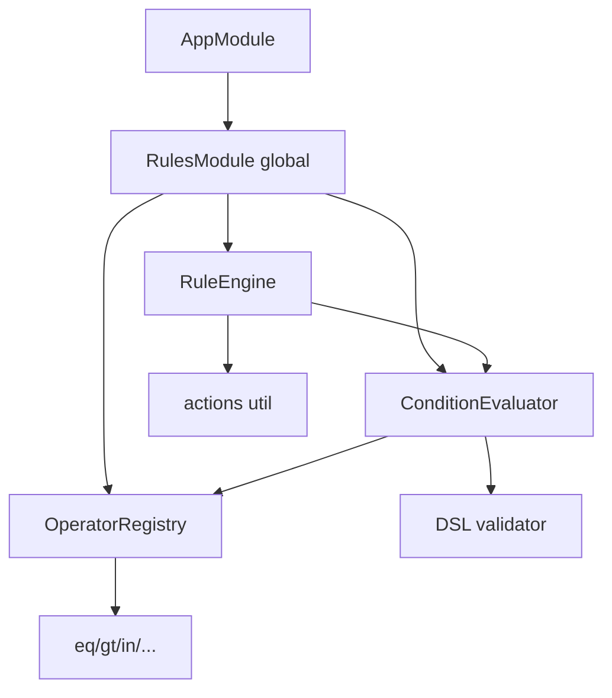

# Rule Engine Architecture

## Design principles

1. **Pure** — same inputs → same `RuleResult`  
2. **Immutable facts** — freeze + actions on clone  
3. **Fail soft** — malformed DSL → `errors[]`, not thrown exceptions  
4. **Extensible operators** — registry, not switch soup  
5. **Domain-agnostic** — no marketing/shipping imports  

## Placement

`backend/src/shared/rules/` alongside StateMachine, Case Management, Workflow.

## Best practices

- Keep condition JSON small; prefer domain pre-filters for huge catalogs  
- Always pass `now` as an ISO string in facts for time windows  
- Persist `reasons` on audit rows when declining promotions  
- Register custom operators only when a domain truly needs a new leaf op  

See also: [RuleEngine.md](./RuleEngine.md), [ConditionDSL.md](./ConditionDSL.md), [OperatorReference.md](./OperatorReference.md), [Architecture.md](./Architecture.md) (Rule Engine).
