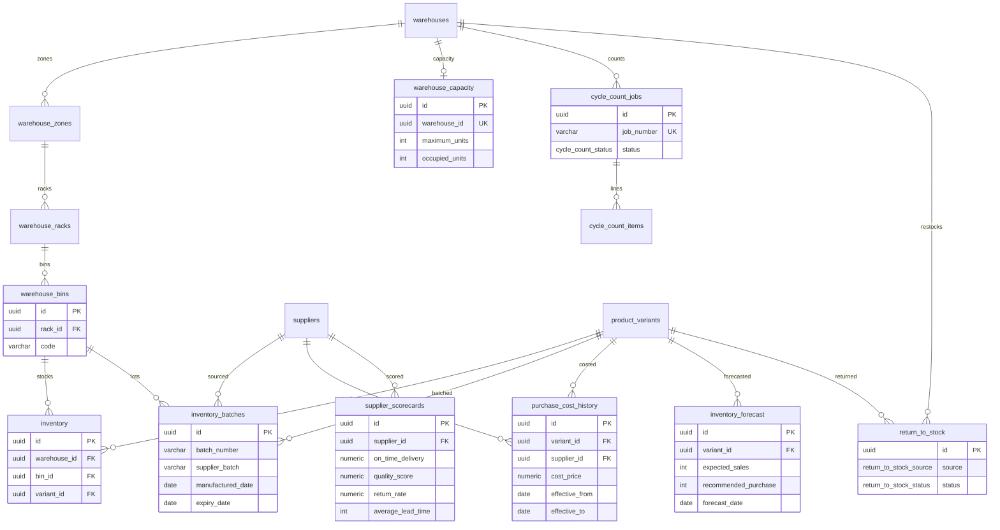
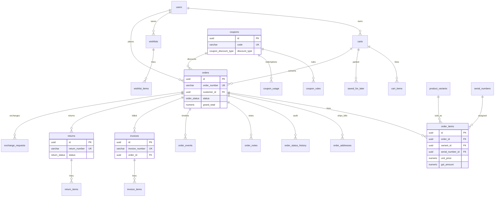
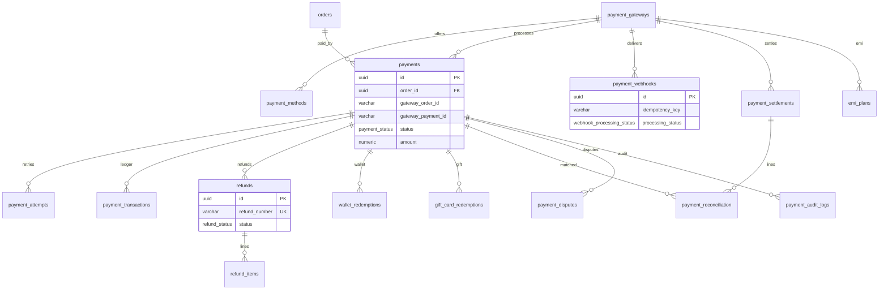
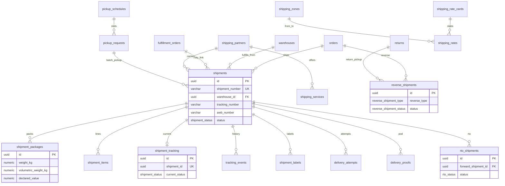
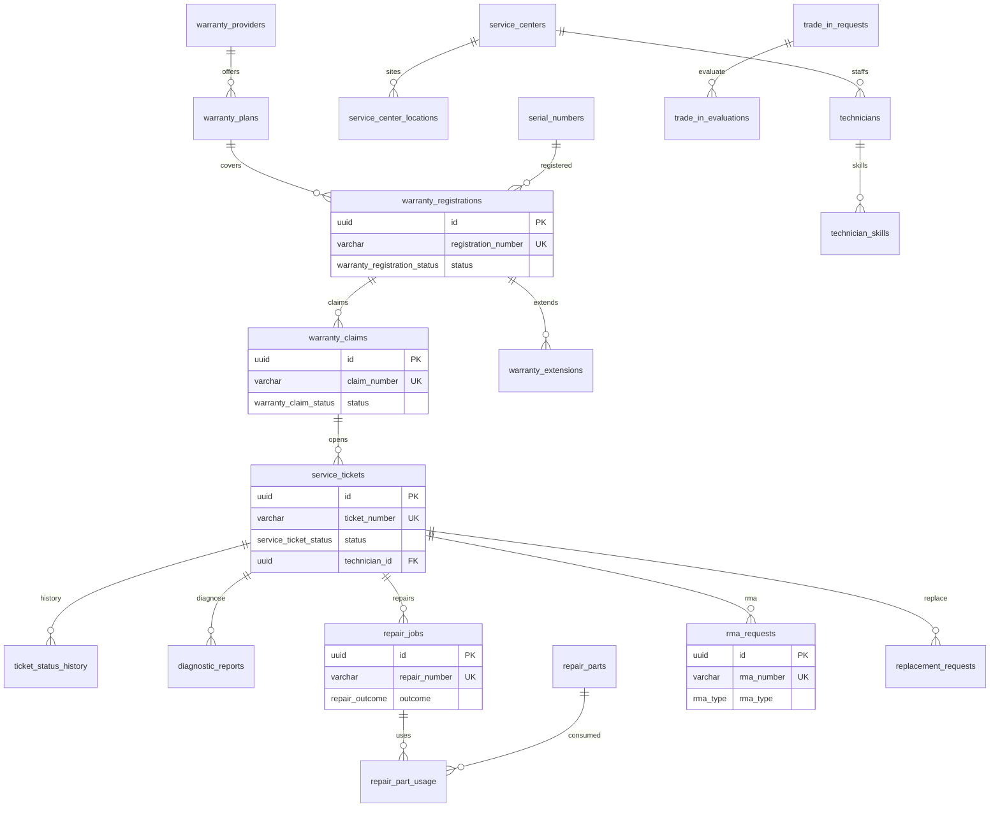
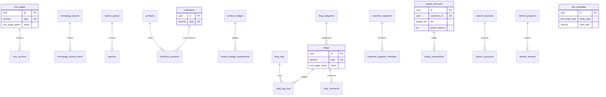
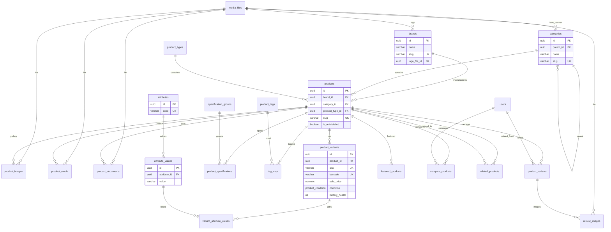
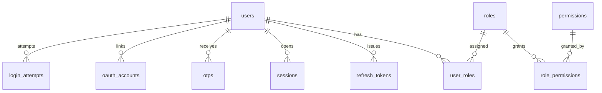

# ERD — Electronics Cart Database

## Phase 1 Authentication (approved — locked)

Auth tables are frozen except FK targets from later phases (`users.id`).

## Phase 2 Catalog (approved — locked)

Catalog tables are frozen except FK targets (`product_variants.id`).

## Phase 3 Inventory (approved — locked)

### Inventory tables

| Table | Role |
|-------|------|
| `warehouses` | Multi-DC master |
| `warehouse_zones` / `warehouse_racks` / `warehouse_bins` | Location tree |
| `warehouse_capacity` | Max vs occupied units |
| `suppliers` / `supplier_contacts` / `supplier_scorecards` | Vendor + KPIs |
| `inventory` | Qty buckets (**bin × variant**) |
| `inventory_batches` | Lot / batch / expiry |
| `purchase_cost_history` | Supplier cost dating |
| `inventory_movements` | Stock ledger |
| `stock_reservations` | Checkout holds |
| `serial_numbers` | Unit / IMEI / refurb |
| `purchase_orders` / items · `goods_receipts` / items | Procurement |
| `stock_transfers` / items | Inter-warehouse |
| `return_to_stock` | Customer / warranty / service / open-box |
| `inventory_forecast` | Demand / buy plan |
| `inventory_adjustments` | Corrections |
| `cycle_count_jobs` / `cycle_count_items` | Cycle counts |
| `low_stock_alerts` | Reorder notifications |

### Design notes

- Hierarchy: **warehouse → zone → rack → bin → inventory**.
- Stock at **bin** level; warehouse availability is `SUM` over bins.
- `inventory_audits` replaced by `cycle_count_jobs` + `cycle_count_items`.
- `cart_id` / `order_id` on reservations are UUID placeholders until Phase 4 Orders.
- Refurbishment stays on `serial_numbers.refurbishment_status`.

## Phase 4 Orders & Sales (approved — locked)

### Orders tables

| Table | Role |
|-------|------|
| `carts` / `cart_items` | Guest + user carts |
| `wishlists` / `wishlist_items` | Saved products |
| `saved_for_later` | Parked cart lines |
| `coupons` / `coupon_rules` / `coupon_usage` | Promotions |
| `orders` / `order_items` | Sales orders + price/GST/warranty snapshots |
| `order_addresses` | Shipping + billing snapshots |
| `order_status_history` | Status audit trail |
| `order_notes` | Internal / customer notes |
| `order_events` | Timeline |
| `invoices` / `invoice_items` | GST invoice snapshots |
| `returns` / `return_items` | RMA |
| `exchange_requests` | Same / different variant / store credit |
| `wallets` / `wallet_transactions` / `store_credits` | Refunds, promo, exchange balance |
| `gift_cards` / `gift_card_transactions` | Prepaid gift codes |
| `fulfillment_orders` / `fulfillment_items` | Split ship per warehouse |
| `pick_lists` / `packing_lists` | WMS pick/pack |
| `order_risk_scores` / `risk_events` | Fraud signals |
| `invoice_documents` | PDF via `media_files` |
| `cancellation_reasons` | Normalized cancel codes |

### Design notes

- Line snapshots freeze catalog changes after purchase.
- `stock_reservations.cart_id` / `order_id` FKs added in Phase 4 (inventory table otherwise locked).
- Payments and shipment carriers are Phase 5 / 6 (locked / ready).

---

## Phase 5 Payments (approved — locked)

### Payments tables

| Table | Role |
|-------|------|
| `payment_gateways` / `payment_methods` | Razorpay + future gateways |
| `payments` | Order tenders (partial OK) |
| `payment_attempts` | Retries |
| `payment_transactions` | Auth/capture/refund ledger |
| `payment_webhooks` | Raw + idempotent processing |
| `payment_settlements` / `payment_reconciliation` | Bank settlement match |
| `refunds` / `refund_items` | Full/partial refunds |
| `wallet_redemptions` / `gift_card_redemptions` | Internal tender |
| `emi_plans` | Bank / no-cost EMI |
| `payment_disputes` | Chargebacks |
| `payment_audit_logs` | Status audit |
| `saved_payment_methods` | Gateway tokens only (no card data) |
| `settlement_batches` | Finance settlement batches |
| `merchant_accounts` | Marketplace payout accounts |
| `payment_events` | Replayable payment events |
| `exchange_rates` | FX rates |

### Design notes

- Multiple `payments` per order enable split tender and retries.
- Gateway secrets never stored in DB; saved methods store **tokens only**.
- Primary gateway seed: Razorpay.

---

## Phase 6 Shipping (approved — locked)

### Shipping tables

| Table | Role |
|-------|------|
| `shipping_partners` / `shipping_services` | Shiprocket + carriers |
| `shipping_zones` / `shipping_rate_cards` / `shipping_rates` | Rating |
| `shipping_rules` | Warehouse → carrier routing |
| `shipments` / `shipment_items` / `shipment_packages` | Split ship + packages |
| `awb_numbers` / `shipment_labels` | AWB pool + labels |
| `shipment_tracking` / `tracking_events` | Current + history |
| `pickup_schedules` / `pickup_requests` | Warehouse pickup |
| `delivery_attempts` / `delivery_proofs` | OFD + POD |
| `reverse_shipments` / `rto_shipments` | Returns / RTO |
| `shipping_webhooks` | Carrier webhooks |
| `carrier_sla` | Partner SLA metrics |
| `shipment_insurance` | High-value cover + claims |
| `delivery_slots` | Scheduled delivery windows |
| `pickup_points` | Stores / lockers |
| `shipping_cost_breakdown` | Fee line items |
| `delivery_failure_reasons` | Normalized OFD failures |
| `shipment_eta_history` | ETA change log |

### Design notes

- One order → many shipments; each shipment → one warehouse.
- Delivery exceptions live on `tracking_events` / `delivery_attempts` (+ normalized failure reasons).
- Primary partner seed: Shiprocket.

---

## Phase 7 Warranty & Service (approved — locked)

### Warranty & service tables

| Table | Role |
|-------|------|
| `warranty_providers` / `warranty_plans` | OEM / extended / ADP / AMC |
| `warranty_registrations` / `warranty_extensions` | Coverage on serials |
| `warranty_claims` / `claim_documents` / `warranty_status_history` | Claims |
| `service_centers` / `service_center_locations` | Bench network |
| `technicians` / `technician_skills` | Assignment |
| `service_tickets` / `ticket_status_history` | Service workflow |
| `diagnostic_reports` / `repair_jobs` / `repair_parts` / `repair_part_usage` | Repair |
| `replacement_requests` / `replacement_items` | Swap / credit |
| `rma_requests` | DOA / repair / replace / refund |
| `trade_in_requests` / `trade_in_evaluations` | Buyback prep |
| `service_feedback` / `service_documents` / `service_audit_logs` | CX + audit |
| `service_contracts` / `contract_items` / `contract_renewals` | Enterprise AMC |
| `spare_part_suppliers` / `supplier_part_catalog` | Spare procurement |
| `technician_certifications` | Qualifications + expiry |
| `repair_metrics` | Turnaround analytics |
| `device_health_reports` | Component health |
| `service_sla` | Response/resolution SLAs |
| `loan_devices` / `loan_allocations` | Temporary replacements |

### Design notes

- Ticket workflow matches: created → … → closed.
- Spare usage links inventory + warehouse + optional serial + claim.
- Phase 8 Service Center is absorbed into Phase 7.

---

## Phase 8 Marketing / CMS (approved — locked)

### Marketing tables

| Area | Tables |
|------|--------|
| CMS | `cms_pages`, `cms_sections`, `homepage_layouts`, `homepage_section_items` |
| Merch | `banners`, `banner_groups`, `collections`, `product_badges` |
| Content | blogs (+ cats/tags/comments), `buying_guides`, FAQs |
| Campaigns | newsletter, email/push/SMS, notification templates |
| Loyalty | accounts, txs, reward rules, referrals |
| Personalization | segments, recommendations, recently viewed |
| SEO / search | metadata, redirects, keywords, synonyms, popular, zero-result |
| Experimentation | A/B tests, feature flags |
| Attribution | channels, UTM campaigns, order attribution |
| SEO ops | health reports, broken links, missing metadata |
| Versioning | content versions, page revisions |

### Design notes

- Homepage builder = layout + ordered section items + `config_json`.
- Coupons stay in Phase 4; campaigns promote them.
- Next phase: Analytics.

---

## Phase 9 Analytics (approved / locked — v1.0)

```mermaid
erDiagram
  users ||--o{ audit_logs : performs
  users ||--o{ user_events : emits
  users ||--o{ customer_ltv : ltv
  search_logs ||--o{ search_clicks : clicks
  products ||--o{ product_views : viewed
  products ||--o{ product_performance : daily
  dashboard_layouts ||--o{ dashboard_widget_instances : places
  dashboard_widgets ||--o{ dashboard_widget_instances : rendered
  saved_reports ||--o{ scheduled_reports : schedules
  saved_reports ||--o{ report_exports : exports
  data_marts ||--o{ etl_jobs : runs
  etl_jobs ||--o{ warehouse_exports : produces
  metric_streams ||--o{ live_metrics : samples
  alert_rules ||--o{ alert_notifications : notifies
  alert_rules ||--o{ alert_history : fires
  ab_tests ||--o{ experiment_metrics : measures
  retention_policies ||--o{ archive_jobs : archives
  orders ||--o{ fraud_alerts : flags

  audit_logs {
    uuid id PK
    varchar entity_type
    varchar action
    timestamptz created_at
  }

  user_events {
    uuid id PK
    user_event_type event_type
    timestamptz created_at
  }

  sales_metrics {
    uuid id PK
    date metric_date
    analytics_period period
    numeric revenue
  }

  kpi_snapshots {
    uuid id PK
    varchar domain
    jsonb metrics_json
  }

  api_request_logs {
    uuid id PK
    smallint status_code
    int latency_ms
  }

  etl_jobs {
    uuid id PK
    etl_job_status status
  }

  live_metrics {
    uuid id PK
    numeric value
    timestamptz created_at
  }

  alert_rules {
    uuid id PK
    alert_severity severity
  }
```

### Analytics tables

| Area | Tables |
|------|--------|
| Audit | `audit_logs` (append-only), `activity_logs`, `system_events` |
| Behavior | user events, page/screen views, sessions |
| Funnel/search | search logs/clicks, conversions, cart abandonment, product views |
| KPIs | sales/inventory/payment/shipping/service/marketing metrics + snapshots |
| Campaigns | campaign_performance, email/push/sms statistics |
| BI | dashboards, saved/scheduled reports, exports |
| Monitoring | error, API, job, webhook logs |
| Warehouse *(optional)* | `data_marts`, `etl_jobs`, `warehouse_exports` |
| Real-time *(optional)* | `metric_streams`, `live_metrics` |
| Alerting *(optional)* | `alert_rules`, `alert_notifications`, `alert_history` |
| Experiments *(optional)* | `experiment_metrics` |
| LTV *(optional)* | `customer_ltv`, `cohort_analysis` |
| Fraud *(optional)* | `fraud_metrics`, `fraud_alerts` |
| Retention *(optional)* | `retention_policies`, `archive_jobs` |

### Design notes

- `audit_logs` has no update/delete path; `live_metrics` / `alert_history` are also append-style.
- Domain audit tables (payments/service) remain; global audit is cross-cutting.
- Optional extensions (`043`–`045`) reserve BI / streaming / governance without a Phase 10 module.
- Phase 9 completes the planned DB module sequence — **v1.0 locked**. Ready for backend implementation.

---

## Phase 2 Catalog (detail)

### Catalog tables

| Table | Role |
|-------|------|
| `media_files` | S3 object registry (no raw URLs on products) |
| `brands` | Brand master |
| `categories` | Nested tree (`parent_id`); subcategory = child |
| `product_types` | New / Refurbished / Open Box |
| `products` | Sellable product + SEO |
| `product_variants` | SKU-level config + facet columns |
| `product_images` / `product_media` / `product_documents` | Media links |
| `attributes` / `attribute_values` / `variant_attribute_values` | Dynamic EAV |
| `specification_groups` / `product_specifications` | PDP spec sheets |
| `product_tags` / `tag_map` | Marketing tags |
| `product_reviews` / `review_images` | Reviews |
| `compare_products` | Compare tray |
| `related_products` | Cross-sell / upsell / FBT |
| `featured_products` | Merchandising slots |

### Design notes

- **No separate `subcategory` table** — nesting via `categories.parent_id` (3NF, Amazon-style).
- Variant **facet columns** (RAM, CPU, …) are indexed for PLP filters; EAV covers long-tail attrs.
- `rating_avg` / `review_count` on `products` are **maintained caches** for sort/search (updated by app/trigger).

---

## Phase 1 Authentication (reference)

